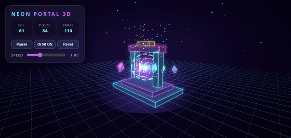

<div align="center">

<h1>Tandem MCP</h1>


<p>
  <a href="https://github.com/ALENOC/tandem-mcp/releases"></a>
  <a href="https://github.com/ALENOC/tandem-mcp/actions/workflows/tests.yml"></a>
  <a href="pyproject.toml"></a>
  <a href="LICENSE"></a>
</p>

</div>

Tandem MCP lets the model in your chat hand part of a coding task to a model running on your own machine. A typical request is “fix this function, leave the tests alone, and show me the diff.” The cloud model decides what to hand off. The local model does the edit, and Tandem returns the changes and test results for review.

## Connect your agent

Tandem runs as a local MCP server over standard input and output (stdio). The installer registers it with **Claude Code**, **Codex** and **Antigravity**. You can also register the same server manually in **Gemini CLI** or another client that can launch a local stdio server. Each client handles its own tool permissions. [Setup and manual configuration](docs/GETTING_STARTED.md#3-register-with-your-mcp-client)

## How a delegated edit works

<p align="center"><a href="assets/architecture.svg"></a></p>

1. **Your agent sets the task.** Say you ask it to fix a discount calculation. The agent can call `delegate` with the goal, the file the worker may edit and the test to run.
2. **Tandem asks the local model.** The server sends the task and relevant context to your model endpoint, keeping the prompt prefix stable so the local server reuses its KV cache. The model can ask to read a file, propose an edit or request a command.
3. **Tandem applies the edit and checks it.** The server handles those tool calls inside the workspace limits. It runs the requested test and records the result and the diff. Command isolation depends on the configured sandbox.
4. **Your agent reviews the result.** It can inspect the diff and test output, report a failure or request a rollback. For a read-only question, it can use a digest tool and ask for the relevant lines directly.

[Architecture in detail](docs/ARCHITECTURE.md) · [Workspace and sandbox permissions](docs/SECURITY_MODEL.md)

## Why a server, and not just a prompt?

You could tell your agent to call the local model itself, for example with `curl` against LM Studio. It works, but it saves little and checks nothing.

| | Agent calls the local model directly | Through Tandem |
| --- | --- | --- |
| **Who writes the files** | The local model answers with text. The agent reads it and writes it to disk, paying output tokens, the most expensive kind, for code it did not write. | The local model edits the files itself through tools. The code never passes through the cloud model. |
| **Who runs the repair loop** | The agent. Each failed test is one more cloud turn: read the error, write a new prompt, read the new answer. | Tandem, locally. It runs the checks, keeps the failing lines even in long outputs, stops early if the worker repeats the same failure three times, and returns one line at the end. |
| **What gets checked** | Whatever the agent remembers to check, after it has read the output. | Every job: checks run before the edit and must pass after it, slow passing checks go back once, test files are read-only and restored if touched, each constraint needs a cited line, and web pages are checked in headless Chromium against a 40 FPS floor with live 1280x800 screenshot capture, optional local VLM visual review (against the contract or a `reference_image`), and screenshot attachment on the receipt. |
| **What the local model may touch** | Anything the agent's shell can reach. | Only the files in `write_globs` and the commands in `allow_run`, in a Bubblewrap jail on Linux. Outbound symlinks are refused and secrets are masked in tool output. |
| **Undo** | By hand, or with git if the work was committed. | `job_rollback` restores the original bytes from the job journal. |
| **Long jobs** | A shell call that runs for an hour hits the client timeout. | Progress notifications keep the call alive. Job state is stored on disk, and a failed job can go on with `job_continue`. |

In short: without a server, the agent still reads and writes everything the local model produces, so most of the cloud cost stays. Tandem keeps that traffic on your machine and returns only the verdict.

## Does it save cloud tokens?

Yes, on medium and large work. With **Opus 5.5** as the orchestrator in Claude Code and the autonomous profile (Tandem **4.1.0** series), Opus writes a contract once. Tandem's local model then writes the code and repairs it against the checks, with no cloud call, and Opus gets back one line. Across four medium and large tasks, four counterbalanced pairs each (16 attempts per arm), Tandem cut the total cloud bill by **57%** and the cost per successful result by **61%** (`$0.217` against `$0.556`), using **67% fewer output tokens** (excluding two infrastructure incidents in the final run, one per arm: **10/15** successes each, **-61%** total and per success, **-72%** output tokens).

| Task | Direct | With Tandem | Cloud cost per success |
| --- | --- | --- | ---: |
| Cron parser module with tests | $0.441 · 3/4 · 97 s | $0.173 · 3/4 · 19 min | **-61%** |
| Boids web simulation | $0.232 · 4/4 · 67 s | $0.117 · 4/4 · 7 min | **-50%** |
| Orbital web simulation | $1.195 · 1/4 · 81 s | $0.470 · 2/4 · 39 min | **-61%** |
| 3D neon portal (4 files) | $1.056 · 2/4 · 2.4 min | $0.232 · 2/4 · 23 min | **-78%** |
| **All 16 attempts** | **$5.56 · 10/16** | **$2.39 · 11/16** | **-61%** |
| **Without 2 infra incidents (15)** | **$5.21 · 10/15** | **$2.05 · 10/15** | **-61%** |

Each cell gives the cost per success (list prices, failed attempts counted), the successes inside the time budget and the median time. The 16 pairs span the three progressive 4.1.0 runs (`pilot1`, `confirm`, `final`) on the exact same independent evaluators as 4.0.0.

The trade-offs:

- **Small edits do not pay:** in the 4.0.0 baseline (`v3`, 3 pairs), a 5-line bug fix cost **+10%** (`$0.050` against `$0.046`). Tandem tells Opus to do edits under about 30 lines itself.
- **Time:** 4.1.0 cut local per-call time by ~40–45% and dropped the median task time from 25 min to 19 min (0 cut-off replies vs 36 in v3/v4), but a Tandem result still takes ~7–39 minutes median against ~1–2.5 minutes direct.
- **Sample size and incidents:** with 4 pairs per task, a 1- or 2-success gap is not statistically decisive. The final run had one infrastructure incident per arm (a GPU reset during Tandem Orbital, where Opus wrote the page itself, and a 74-minute API stall during Direct Cron); both the raw 16-attempt and clean 15-attempt totals are shown above.
- **Finish:** the 40 FPS web-check gate closed the runtime performance gap (55–60 FPS in pilot/confirm; 38–39 FPS vs 40 direct on the heavier final portal, up from 4–20 FPS in 4.0.0). Visual polish remains stronger on the direct path: the local model builds what the contract asks for and little more.

Test machine: Intel Core i9-9900K, AMD Radeon RX 6800 series GPU with 16 GB VRAM, LM Studio 0.4.28 (Vulkan) running `Qwen3.8-27B-UD-IQ3_S` fully on the GPU with a 65,536-token context. [Full hardware and model settings](docs/BENCHMARKS.md#test-machine-and-local-model)

[All results, method and earlier iterations](docs/BENCHMARKS.md) · [Interactive comparison, also on mobile](https://alenoc.github.io/tandem-mcp/)

### 3D neon portal

<table>
  <tr>
    <th width="50%">Direct (final, pair 1)</th>
    <th width="50%">With Tandem (final, pair 1)</th>
  </tr>
  <tr>
    <td></td>
    <td></td>
  </tr>
  <tr>
    <td align="center">$0.36 cloud · 97 s · failed (interactions)</td>
    <td align="center">$0.11 cloud · 22 min · passed</td>
  </tr>
</table>

### Orbital simulation

<table>
  <tr>
    <th width="50%">Direct (pilot, pair 1)</th>
    <th width="50%">With Tandem (confirm, pair 2)</th>
  </tr>
  <tr>
    <td></td>
    <td></td>
  </tr>
  <tr>
    <td align="center">$0.31 cloud · 88 s · passed</td>
    <td align="center">$0.15 cloud · 11 min · passed</td>
  </tr>
</table>

## Try it

Start a local OpenAI-compatible model server and load a model. LM Studio usually listens at `http://127.0.0.1:1234/v1`. You will also need Python 3.11 or newer and, for secure command execution on Linux, Bubblewrap.

```sh
git clone https://github.com/ALENOC/tandem-mcp
cd tandem-mcp
python3 -m venv .venv
.venv/bin/pip install .
.venv/bin/python scripts/install.py
```

Restart your MCP client, open a project and try a read-only request:

> Use Tandem to find where this project validates its input. Give me the file names and line numbers.

For a first edit, pick a failing test and tell the worker which file it may change:

> Use Tandem to fix the discount calculation in discount.py. Keep the tests unchanged, run them, and show me the diff.

For manual setup or a different model endpoint, see [Getting Started](docs/GETTING_STARTED.md) and [Configuration](docs/CONFIGURATION.md). The tools are listed in the [tool reference](docs/TOOLS.md).

## License

[MIT](LICENSE). Copyright (c) 2026 Alessandro Nocentini ([ALENOC](https://github.com/ALENOC)). As the MIT license requires, forks and derivative works must keep this copyright notice and the license text.

[Changelog](CHANGELOG.md) · [Security policy](SECURITY.md)
